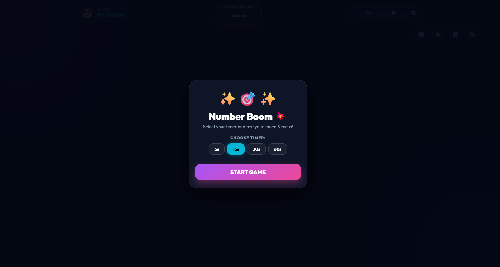
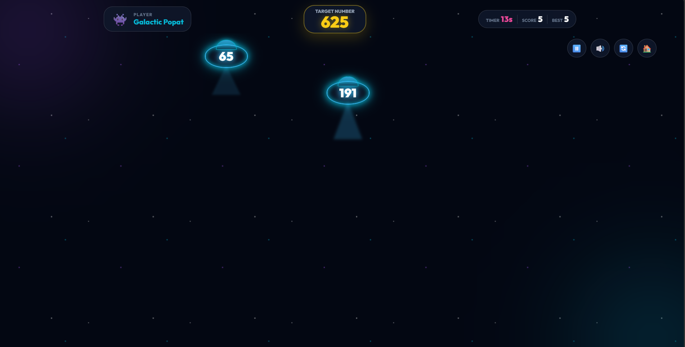

# NumberBoom 🎯

A fast-paced casual arcade web game built with HTML, CSS, and JavaScript.

## 🚀 Live Demo

[🎮 Play NumberBoom](https://aryanyadav196.github.io/numberboom/)

## 🎮 About the Game

NumberBoom is a speed and focus game where random numbers appear on the screen and the player must quickly find and tap the target number shown at the top.

The game is designed to be fast, simple, and fun while keeping the gameplay fair.

## 📸 Screenshots

### 🎮 Game Start Screen



### ⚡ Active Gameplay



### 🏆 Game Over / Score Screen


## ✨ Features

- 🎯 **Target Number Hunt** — Quickly find and click the target number displayed at the top.
- ⏱️ **Dynamic Timer System** — Correct clicks reward the player with bonus time while respecting the selected mode's maximum timer limit.
- ⚡ **Fair Spawn System** — Button spawn rate and screen duration are capped to keep high-level gameplay challenging but humanly playable.
- 🛡️ **Bad Luck Protection** — After three consecutive non-target or fake buttons, the next button is guaranteed to contain the target number.
- 💣 **Bomb Buttons** — Dangerous buttons can instantly end the game, adding risk to every click.
- 😄 **Funny Fake Buttons** — Distracting buttons with humorous labels make target selection more challenging.
- 🥷 **Random Player Identities** — Players can start instantly with automatically generated funny identities.
- 🚀 **Fast-Paced Gameplay** — Designed for quick reactions, focus, and increasing pressure.

## 🛠️ Technologies

- **HTML5** — Game structure and semantic markup
- **CSS3** — Styling, layout, animations, and responsive design
- **JavaScript** — Game logic, timer system, button generation, scoring, and interactions

## 🎮 Gameplay

1. **Start the Game** — Begin a new round and get ready to react quickly.
2. **Check the Target** — A target number is displayed at the top of the game screen.
3. **Find the Match** — Search the buttons appearing on the screen and locate the matching target number.
4. **Click Quickly** — Select the correct number before it disappears.
5. **Avoid Traps** — Fake buttons can distract you, while bomb buttons can immediately end the game.
6. **Build Your Score** — Keep finding targets and use the available time efficiently to achieve a higher score.

### ⏱️ Timer Mechanics

Correct target clicks provide a **+10 second time bonus**, but the timer cannot exceed the maximum limit of the selected game mode.

### 🛡️ Fairness System

To prevent unlucky random sequences, the game guarantees a target-number button after three consecutive non-target or fake buttons.

## 📂 Project Structure

```text
numberboom/
├── index.html      # Main game page
├── style.css       # Game styling and responsive layout
├── main.js         # Game logic and interactions
├── README.md       # Project documentation
├── LICENSE         # Project license
└── .gitignore      # Files excluded from Git tracking